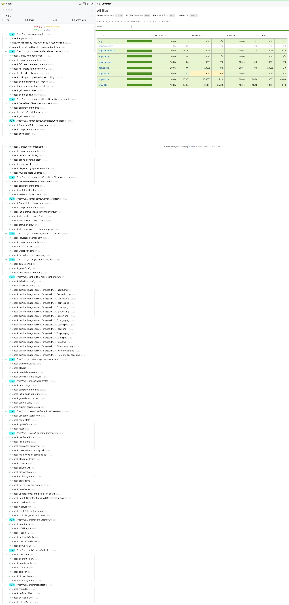

# Tic Tac Toe

By **MRazinShaikh**


## Installation

Make sure to install dependencies:

```bash
bun install
```

## Development

Start the development server on `http://localhost:3000`:

```bash
bun run dev
```

## Deployment

This project is deployed on Vercel:

**Live Site:** [https://tic-tac-toe-mrazinshaikh.vercel.app/](https://tic-tac-toe-mrazinshaikh.vercel.app/)

### Deployment Configuration

- **Build Command:** `bun run generate`
- **Output Directory:** `.output/public`
- **Platform:** Vercel

The project uses Nuxt 4 with static site generation.

### Test Coverage

